# Zarlio — entity-relationship diagram

Generated from the database schema by `php artisan talata:erd` (do not edit by hand; re-run after migrations).
Shows primary keys, foreign keys, `tenant_id`, `public_id` and `status`. Framework tables (sessions, cache, jobs, migrations) are omitted.

Tables carrying `tenant_id` (merchant data uses the fail-closed `BelongsToTenant` scope; audit, log and admin tables only reference the shop — see `docs/adr/0003-tenant-isolation.md`): `admin_actions`, `affiliate_commissions`, `affiliate_referrals`, `audit_events`, `billing_orders`, `customers`, `feature_overrides`, `installment_agreements`, `installment_lines`, `installment_payments`, `invoice_counters`, `invoice_item_assets`, `invoice_items`, `invoice_layouts`, `invoice_shares`, `invoice_verification_revocations`, `invoices`, `memberships`, `settings_backups`, `shop_profiles`, `sms_credit_entries`, `sms_credit_lots`, `sms_messages`, `sms_settings`, `subscriptions`, `system_logs`, `tenant_business_types`, `tenant_settings`.

```mermaid
erDiagram
    affiliates ||--o{ affiliate_commissions : "affiliate_id"
    billing_orders ||--o{ affiliate_commissions : "order_id"
    affiliate_payouts ||--o{ affiliate_commissions : "payout_id"
    affiliate_referrals ||--o{ affiliate_commissions : "referral_id"
    tenants ||--o{ affiliate_commissions : "tenant_id"
    affiliates ||--o{ affiliate_payouts : "affiliate_id"
    affiliates ||--o{ affiliate_referrals : "affiliate_id"
    tenants ||--o{ affiliate_referrals : "tenant_id"
    users ||--o{ affiliates : "user_id"
    affiliates ||--o{ billing_orders : "affiliate_id"
    users ||--o{ billing_orders : "created_by"
    tenants ||--o{ billing_orders : "tenant_id"
    users ||--o{ customers : "created_by"
    tenants ||--o{ customers : "tenant_id"
    tenants ||--o{ feature_overrides : "tenant_id"
    users ||--o{ installment_agreements : "created_by"
    customers ||--o{ installment_agreements : "customer_id"
    invoices ||--o{ installment_agreements : "invoice_id"
    tenants ||--o{ installment_agreements : "tenant_id"
    installment_agreements ||--o{ installment_lines : "agreement_id"
    tenants ||--o{ installment_lines : "tenant_id"
    installment_agreements ||--o{ installment_payments : "agreement_id"
    users ||--o{ installment_payments : "recorded_by"
    tenants ||--o{ installment_payments : "tenant_id"
    tenants ||--o{ invoice_counters : "tenant_id"
    invoice_items ||--o{ invoice_item_assets : "invoice_item_id"
    tenants ||--o{ invoice_item_assets : "tenant_id"
    invoices ||--o{ invoice_items : "invoice_id"
    tenants ||--o{ invoice_items : "tenant_id"
    tenants ||--o{ invoice_layouts : "tenant_id"
    users ||--o{ invoice_layouts : "updated_by"
    users ||--o{ invoice_shares : "created_by"
    invoices ||--o{ invoice_shares : "invoice_id"
    tenants ||--o{ invoice_shares : "tenant_id"
    invoices ||--o{ invoice_verification_revocations : "invoice_id"
    users ||--o{ invoice_verification_revocations : "revoked_by"
    tenants ||--o{ invoice_verification_revocations : "tenant_id"
    users ||--o{ invoices : "created_by"
    customers ||--o{ invoices : "customer_id"
    users ||--o{ invoices : "issued_by"
    invoices ||--o{ invoices : "replaces_invoice_id"
    tenants ||--o{ invoices : "tenant_id"
    users ||--o{ invoices : "voided_by"
    users ||--o{ memberships : "invited_by"
    tenants ||--o{ memberships : "tenant_id"
    users ||--o{ memberships : "user_id"
    billing_orders ||--o{ payment_attempts : "order_id"
    users ||--o{ settings_backups : "created_by"
    tenants ||--o{ settings_backups : "tenant_id"
    staff_users ||--o{ shop_profiles : "name_approved_by"
    tenants ||--o{ shop_profiles : "tenant_id"
    sms_credit_lots ||--o{ sms_credit_entries : "lot_id"
    sms_messages ||--o{ sms_credit_entries : "sms_message_id"
    tenants ||--o{ sms_credit_entries : "tenant_id"
    tenants ||--o{ sms_credit_lots : "tenant_id"
    invoices ||--o{ sms_messages : "invoice_id"
    users ||--o{ sms_messages : "requested_by"
    tenants ||--o{ sms_messages : "tenant_id"
    tenants ||--o{ sms_settings : "tenant_id"
    tenants ||--o{ subscriptions : "tenant_id"
    tenants ||--o{ tenant_business_types : "tenant_id"
    tenants ||--o{ tenant_settings : "tenant_id"
    users ||--o{ tenant_settings : "updated_by"
    admin_actions {
        bigint id PK
        bigint tenant_id
    }
    affiliate_commissions {
        bigint id PK
        bigint affiliate_id FK
        bigint referral_id FK
        bigint tenant_id FK
        bigint order_id FK
        character status
        bigint payout_id FK
    }
    affiliate_payouts {
        bigint id PK
        bigint affiliate_id FK
    }
    affiliate_referrals {
        bigint id PK
        bigint affiliate_id FK
        bigint tenant_id FK
    }
    affiliates {
        bigint id PK
        bigint user_id FK
        character status
    }
    audit_events {
        bigint id PK
        bigint tenant_id
    }
    billing_orders {
        bigint id PK
        character public_id
        bigint tenant_id FK
        bigint created_by FK
        character status
        bigint affiliate_id FK
    }
    customers {
        bigint id PK
        character public_id
        bigint tenant_id FK
        bigint created_by FK
    }
    emergency_rates {
        bigint id PK
    }
    feature_overrides {
        bigint id PK
        bigint tenant_id FK
    }
    installment_agreements {
        bigint id PK
        character public_id
        bigint tenant_id FK
        bigint customer_id FK
        bigint invoice_id FK
        character status
        bigint created_by FK
    }
    installment_lines {
        bigint id PK
        bigint tenant_id FK
        bigint agreement_id FK
    }
    installment_payments {
        bigint id PK
        character public_id
        bigint tenant_id FK
        bigint agreement_id FK
        bigint recorded_by FK
    }
    invoice_counters {
        bigint id PK
        bigint tenant_id FK
    }
    invoice_item_assets {
        bigint id PK
        bigint tenant_id FK
        bigint invoice_item_id FK
    }
    invoice_items {
        bigint id PK
        bigint tenant_id FK
        bigint invoice_id FK
    }
    invoice_layouts {
        bigint id PK
        bigint tenant_id FK
        bigint updated_by FK
    }
    invoice_shares {
        bigint id PK
        bigint tenant_id FK
        bigint invoice_id FK
        bigint created_by FK
    }
    invoice_verification_revocations {
        bigint id PK
        bigint tenant_id FK
        bigint invoice_id FK
        bigint revoked_by FK
    }
    invoices {
        bigint id PK
        character public_id
        bigint tenant_id FK
        character status
        bigint customer_id FK
        bigint issued_by FK
        bigint voided_by FK
        bigint replaces_invoice_id FK
        bigint created_by FK
    }
    market_quotes {
        bigint id PK
    }
    memberships {
        bigint id PK
        bigint tenant_id FK
        bigint user_id FK
        character status
        bigint invited_by FK
    }
    otp_challenges {
        character id PK
    }
    passkeys {
        bigint id PK
    }
    payment_attempts {
        bigint id PK
        bigint order_id FK
        character status
    }
    pricing_versions {
        bigint id PK
        character status
    }
    settings_backups {
        bigint id PK
        bigint tenant_id FK
        bigint created_by FK
    }
    shop_profiles {
        bigint id PK
        bigint tenant_id FK
        bigint name_approved_by FK
    }
    sms_credit_entries {
        bigint id PK
        bigint tenant_id FK
        bigint lot_id FK
        bigint sms_message_id FK
    }
    sms_credit_lots {
        bigint id PK
        bigint tenant_id FK
    }
    sms_messages {
        bigint id PK
        character public_id
        bigint tenant_id FK
        bigint invoice_id FK
        character status
        bigint requested_by FK
    }
    sms_settings {
        bigint id PK
        bigint tenant_id FK
    }
    staff_users {
        bigint id PK
    }
    subscriptions {
        bigint id PK
        bigint tenant_id FK
        character status
    }
    system_logs {
        bigint id PK
        bigint tenant_id
    }
    tax_rules {
        bigint id PK
        character status
    }
    tenant_business_types {
        bigint id PK
        bigint tenant_id FK
    }
    tenant_settings {
        bigint id PK
        bigint tenant_id FK
        bigint updated_by FK
    }
    tenants {
        bigint id PK
        character public_id
        character status
    }
    users {
        bigint id PK
    }
```

